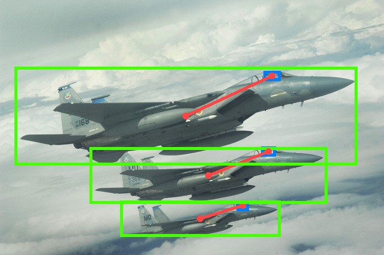
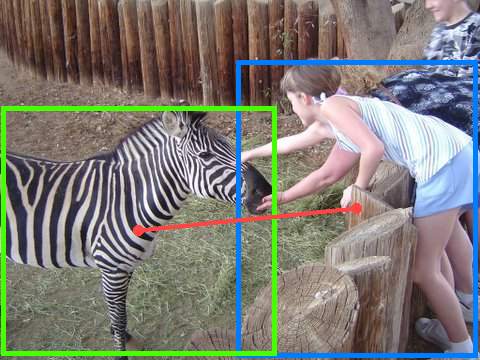

# Visualisation Utilities

## Dataset navigator

A command-line style dataset navigator is provided, which can be used to visualise any number of box pairs of the same interaction type in the same image. To use the navigator, refer to the example below.

```bash
# Run the navigator in a bash shell by selecting a subset
# Select train2015 for the training set and test2015 for the test set
user$ python navigator.py --partition train2015

****************************************
* Welcome to HICODet Dataset Navigator *
****************************************

Commands are listed below:

path(p) - Print path of the current node
list(l) - List all navigable nodes
move(m) - Move to a navigable node
help(h) - Print help manual
exit(e) - Terminate the program

> path
/
> l
images		classes
> m classes
> # Show all classes in the format [class_idx, class_name, num_annotations]
> l
[  0]                 board airplane	(176)
[  1]                direct airplane	(98)
[  2]                  exit airplane	(56)
[  3]                   fly airplane	(181)
...
[598]                    watch zebra	(76)
[599]           no_interaction zebra	(2)
> # Select class 3, which is "fly airplane"
> m 3
> p
/classes/3
> l
[182] 3             [230] 1             [355] 1             [420] 1 
...
[35594] 1           [35599] 2           [35625] 1
> m 182
```


```bash
> p
/classes/3
> m ../597
> l
[16136] 1           [24668] 3
> m 16136
```


---

## Generate and visaulise box pairs in large scales

Apart from the single-image visualisations, to get a more holistic view, utilities for generating and visualising the complete collection of box pairs are also provided. Note that this will take a considerable amount of space on your device. Visualisation of the training set will take up about __28G__ of space and the test set about __7G__

```bash
# Generate all box pairs from the training set
python visualise_and_cache.py --partition train2015
# Do the same for test set
python visualise_and_cache.py --partition test2015
```

To visualise the box pairs, select a directory containing generated images

```bash
python generate_html_page.py --image-dir visualisations/train2015/class_000
```

This will create a file called _table.html_ in your current directory. Open the file to visualise box pairs in a web page. For more layout options, refer to the documentation for class [_pocket.utils.ImageHTMLTable_](https://github.com/fredzzhang/pocket/tree/master/pocket/utils) and make corresponding changes in _generate_html_page.py_